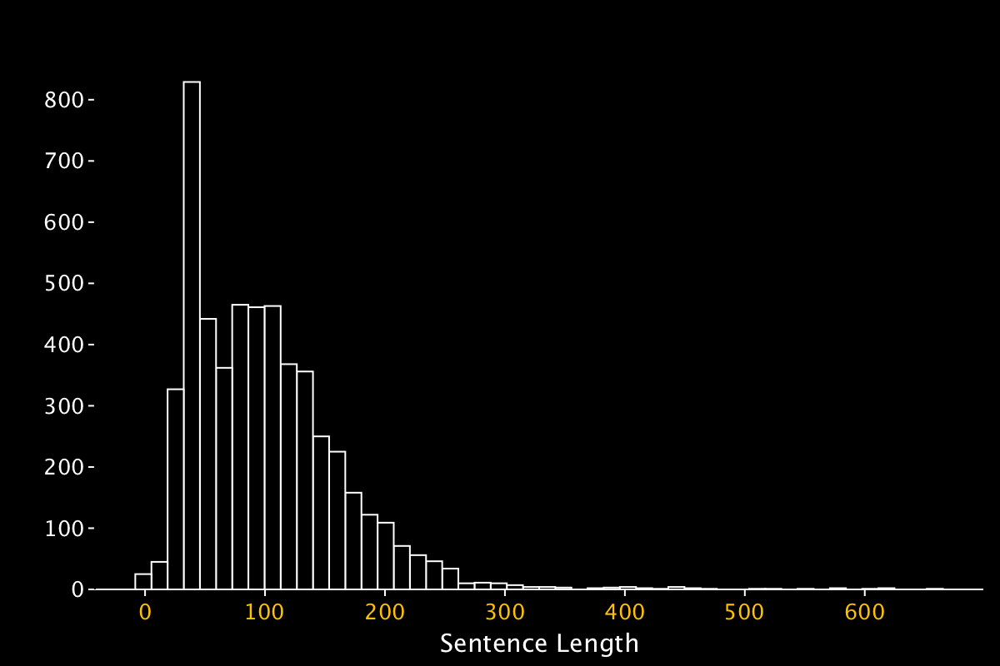
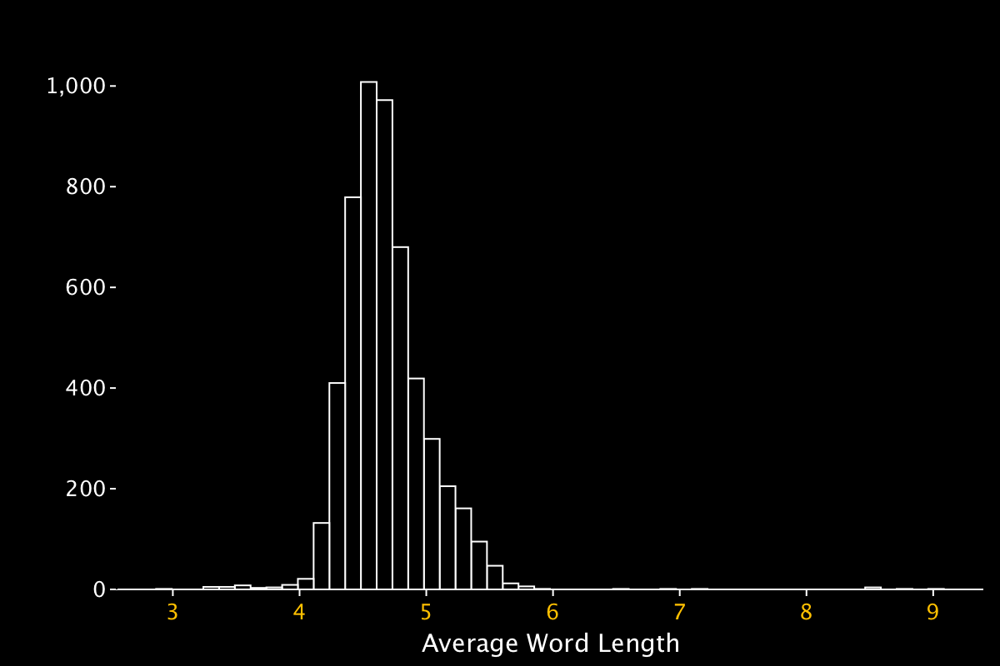
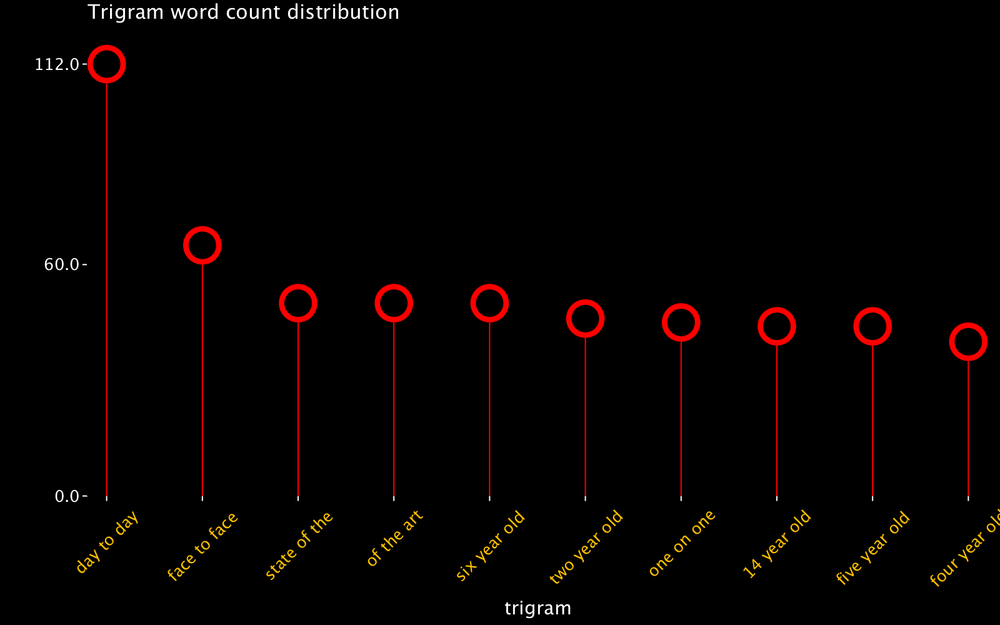

# Ted Talks Recommender and Chatbot Service
This Repo contains my work on scraping ted-talks from Tedtalks.org and building a NLP recommender system. 

This project was a collaboration between myself, Uche, and Brittany. — Will add full names and github links. 

## Data Acquisition 
The data was scraped from tedtalks.org using the BeautifulSoup library. The data was then cleaned and stored in a sql database. Features collected from the site are title, speaker, description, url, and topics and transcript for each talk. There are a total of 6000 talk events from XX authors across XX topics. 

## Exploratory Data Analysis
**2.2. Transcripts and Topics** UCHE

**2.3 Statistics and patterns:** PATRICK
- Sentence structure analysis. The longest transcripts in the corpus is 510 sentences long, majority of the talks are between 25 and 250 sentences long. There were a total of 829 talk events with a transcript of 39 sentences.

 

- Word count analysis. The longest transcript in the corpus is over 12K words. Majority of the transcripts are between 350 and 3,700 words. There was a total of 1,386 talks with a transcript of a little over 770 words.
 

 

- The average word length for words in each talk is between 2 and 9 characters. Majority of the talks have an average word length of 4.5 characters.

 

- Stop word analysis. The word 'the' was used over 390K times in the corpus. The top 10% stop words are 'the', 'to', 'of' ... 'have'. 

 

- Common words. The word 'I' was used over 129K times, 6 times the word 'we'. The most common words are 'I', 'And', ...'really'. 

 

- Bigram analysis. The most common bigrams are 'we re', and the top 3 most common bigrams include some form of the word 'are' or 're'. Top 10 bigrams mostly have 'we', 'you', 'they' preceeding and followed by either 're', 've',  or 'll'.

 

- Trigram analysis. The trigram 'day to day' was used over 100 times in the corpus, 60% of the top 10 tri-grams decribed age — 'six year old', '14 year old'... 'five years old'.

 

